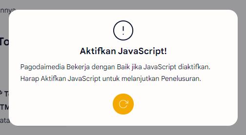

# Anti NoScript

## Peringatan NoScript

Mengakses Situs kami tanpa JavaScript membuat beberapa Fitur tidak dapat Berfungsi dengan Baik termasuk **Halaman Kontak** dan **Umpan Balik**. Anda juga dapat menerima Peringatan NoScript[^1] (Tanpa JavaScript) Seperti ini.

<figure><figcaption>
Peringatan NoScript.
</figcaption></figure>

## Cara Menghilangkan Peringatan NoScript

Untuk Mengatasinya, Ikuti Cara ini.

1. Buka Pengaturan Di Browser anda.
2. Lalu Klik **Privasi dan Keamanan**.
3. Klik **Setelan situs**.
4. Lalu cari Bagian **JavaScript**.
5. Dan Izinkan Situs kami menggunakan **JavaScript**.
6. Lalu Mulai Ulang Halaman Situs kami. Dan Peringatan NoScript telah Hilang.

[^1]: **NoScript** Adalah Sebuah Perangkat lunak atau Fitur yang Berfungsi untuk memblokir JavaScript yang Ada Pada Website.
