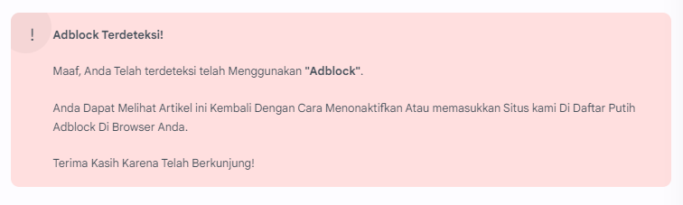
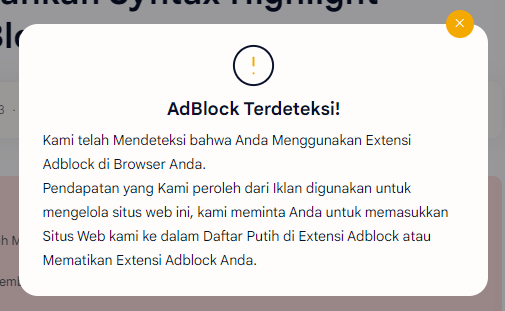

# Peringatan Adblock

## Peringatan Adblock

Jika anda mengunjungi Situs kami menggunakan Ekstensi Adblock[^1] maka Anda dapat melihat Peringatan Adblock Seperti ini.

<figure><figcaption>
Peringatan Adblock (Tidak Dapat Dihapus, Hanya muncul pada Halaman Postingan).
</figcaption></figure>

 

<figure><figcaption>
Peringatan Adblock (Pop Up dan Dapat Dihapus, Muncul pada semua Halaman).
</figcaption></figure>

## Cara Menghilangkan Peringatan Adblock

Untuk Mengatasi masalah ini, Berikut Cara yang dapat Diikuti.

1. Pergi ke Tab atau Halaman Ekstensi anda.
2. Nonaktifkan atau masukkan Situs kami di Daftar Putih Plugin Adblock atau Pemblokir Iklan anda.
3. Coba Muat Ulang Halaman dan Lihat Hasilnya.

Jika Peringatan ini masih Muncul, Coba hapus Kuki Situs kami dan Mulai ulang.


Jika Anda ingin Menghubungi Kami, Hubungi kami melalui [Halaman Kontak](https://www.pagodaimedia.my.id/p/contact-us.html).


[^1]: **Adblock** adalah Suatu Aplikasi atau Ekstensi yang Dapat Mencegah Munculnya Elemen yang dianggap Menganggu Seperti Iklan.
