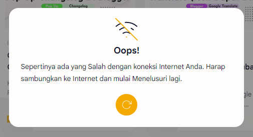

# Peringatan Koneksi Buruk

## Peringatan Hilang Jaringan

Jika anda mengunjungi Situs kami dengan Koneksi Internet yang Buruk atau bahkan Tanpa Koneksi Internet, Mungkin anda akan Melihat Peringatan Hilang Jaringan seperti ini.

<figure><figcaption>
Peringatan Koneksi Internet Buruk.
</figcaption></figure>

## Cara Menghilangkan Peringatan Koneksi Buruk

Berikut adalah Cara Menghilangkannya.

1. Periksa Koneksi Internet anda, Pastikan Perangkat anda terhubung dengan **Wifi** atau **Koneksi Jaringan**.
2. Jika sudah Tersambung, Coba Mulai Ulang halaman Situs.
3. Setelah Dimulai Ulang maka Peringatan tersebut akan Hilang. Jika peringatan masih muncul mungkin Disebabkan oleh Buruknya Koneksi Wifi atau Jaringan, Coba tunggu sampai Koneksi Internet Anda menjadi Lancar dan Coba Mulai Ulang Halaman SItus Lagi.
